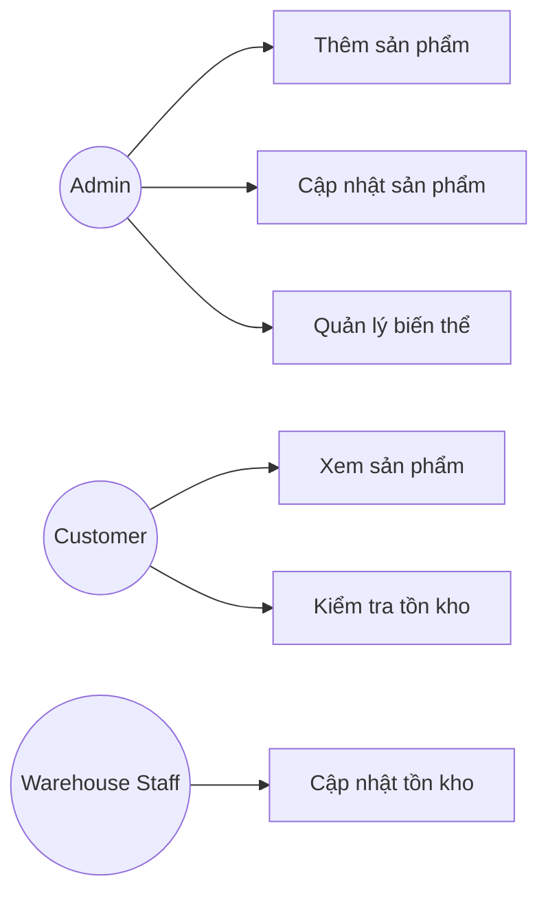
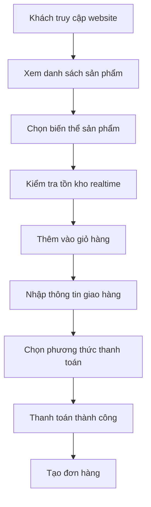

# SRS – Chức năng 2.1: Quản lý Sản phẩm (PIM)
**Dự án:** Website bán thiết bị ngành ảnh Kochi Lens  
**Module:** Product Information Management (PIM)

---

## PHẦN 1 – Mô hình hóa quy trình (Business Flow)

### 1.1 Sơ đồ Use Case

**Actors**
- **Admin:** Quản lý sản phẩm và biến thể.
- **Customer:** Xem sản phẩm và tồn kho realtime.
- **Warehouse Staff:** Cập nhật số lượng tồn kho.

---

### 1.2 Sơ đồ Activity – Luồng đặt hàng

---

## PHẦN 2 – Đặc tả chức năng (Functional Requirements)

### User Story

| ID | User Story | Priority |
|----|------------|----------|
| US-01 | Là Admin, tôi muốn thêm sản phẩm mới để bán trên website | High |
| US-02 | Là Admin, tôi muốn tạo biến thể sản phẩm (màu, kích thước) | High |
| US-03 | Là Admin, tôi muốn cập nhật giá và thuế VAT | High |
| US-04 | Là Warehouse Staff, tôi muốn cập nhật tồn kho | High |
| US-05 | Là Customer, tôi muốn xem tồn kho realtime | High |
| US-06 | Là Customer, tôi muốn xem hình ảnh và mô tả sản phẩm | Medium |
| US-07 | Là Customer, tôi muốn chọn biến thể trước khi mua | High |
| US-08 | Là Admin, tôi muốn ẩn sản phẩm hết hàng | Medium |

---

## PHẦN 3 – Đặc tả dữ liệu (Data Schema)

### 3.1 Partner (Khách hàng)

| Field | Kiểu dữ liệu | Mô tả |
|------|-------------|------|
| PartnerID | UUID | Mã khách hàng |
| Name | String | Tên khách |
| TaxCode | String | MST công ty |
| Phone | String | Số điện thoại |
| Email | String | Email |
| ShippingAddress | Text | Địa chỉ giao hàng |
| CustomerType | Enum | Guest / B2C / B2B |

---

### 3.2 Product

| Field | Kiểu dữ liệu | Mô tả |
|------|-------------|------|
| ProductID | UUID | Mã sản phẩm |
| SKU | String | Mã SKU |
| Barcode | String | Mã vạch |
| ProductName | String | Tên sản phẩm |
| Variant | String | Màu sắc / Kích thước |
| SalePrice | Decimal | Giá bán |
| VAT | Float | Thuế VAT |
| StockQty | Integer | Tồn kho |
| Status | Enum | Active / Inactive |

---

### 3.3 Order

| Field | Kiểu dữ liệu | Mô tả |
|------|-------------|------|
| OrderID | UUID | Mã đơn hàng |
| OrderNumber | String | Số đơn |
| CustomerID | UUID | Khách hàng |
| OrderStatus | Enum | Draft / Confirmed / Cancelled |
| TotalAmount | Decimal | Tổng tiền |
| PaymentStatus | Enum | Pending / Paid |
| CreatedDate | Datetime | Ngày tạo |

---

## Kết luận

Chức năng **PIM** giúp:
- Quản lý sản phẩm và biến thể
- Hiển thị tồn kho realtime
- Đồng bộ dữ liệu với OMS và thanh toán
- Hỗ trợ vận hành kho và bán hàng online

